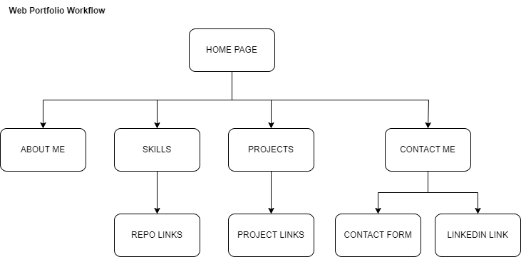
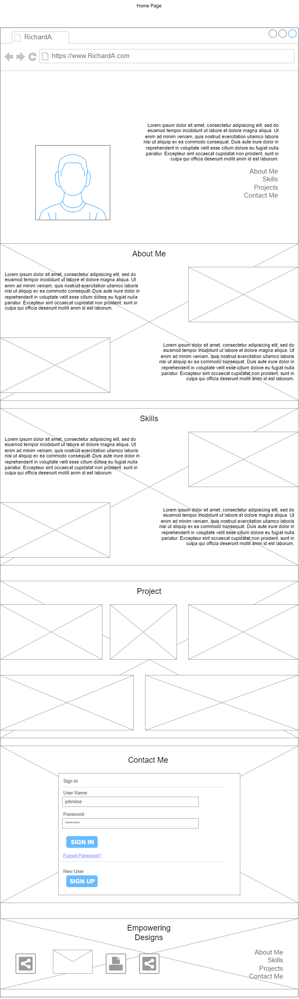

# Capstone Project!🏁

The _grand finale_ project.

This is the culmination of my ALX Software Engineering program, the grand finale project where I'll put into practice everything I've learned in terms of technologies, frameworks, and tools.

# Project Description📖

As I approach the end of my ALX SE program, I'm concluding it with a **_capstone project_**. This project will showcase my skills and expertise in web development.👨👨🏽‍💻 It's an opportunity to give prospective clients an insight into my work and who I am as a developer. The goal is to make it easier for clients to decide whether I'm the right fit for their projects by providing a candid portfolio that displays my experience, past projects, inspirations, and style.

# Index📇

- [Overview](#overview📜)
- [Features](#features🌟)
- [Technologies Used](#technologies-used⛏️)
- [Demo](#demo🖼️)
- [Roadmap](#roadmap🛣️)
- [Contact Me](#get-in-touch🤙🏽)
- [Acknowledgement](#acknowledgement🙏🏽)

## Overview📜

- My capstone project focuses on building my web development portfolio.
- It's designed to offer a glimpse of my work and a sense of who I am as a developer.
- I aim to simplify the decision-making process for clients by presenting a portfolio that's informative and convincing.
- After visiting my portfolio, clients should feel confident in their choice.

## Features🌟

- The portfolio offers a user-friendly and easy-to-navigate layout.
- It provides quick access to my skills, projects, and contact information.
- The design is visually engaging, incorporating colors, shapes, and unique design elements.

## Technologies Used⛏️

- I've utilized various technologies I've learned throughout the program to bring my portfolio to life.
- These technologies include HTML, CSS, and JavaScript.
- Additionally, I've used <a href="https://www.figma.com">Figma</a> and <a href="https://draw.io">Draw.io</a> for design and prototyping.

## Demo🖼️

- Here are a few screenshots to demonstrate the design and features of my web portfolio:
  
  

- I used pencil and paper to come up with the initial design, and then brought it to life in <a href="https://www.figma.com">Figma</a>.

- Keep track of <a href="https://RicCodeX.github.io">real-time development</a> and see it come to live.

## Roadmap🛣️

- I will continuously refine and update my web development portfolio in terms of design, information, and achievements.
- I look forward to engaging with clients and inspiring designers and developers through my portfolio.

# Get In Touch🤙🏽

I'm Richard Agboola, a Nigerian national and an Electrical Engineer by profession.

You can reach me through:

- Email: <a>mrar0220@gmail.com</a>📧
- <a href="https://twitter.com/Ric11o2_" title="Twitter">Twitter</a>✖️

# Acknowledgement🙏🏽

It has been a privilege to be part of this program with amazing peers and wonderful mentors. I extend my gratitude to Cole, Obed, and the entire <a href="https://www.alxafrica.com/" title="ALX Website">ALX</a> community. Cheers to the journey! 🥂🎓
